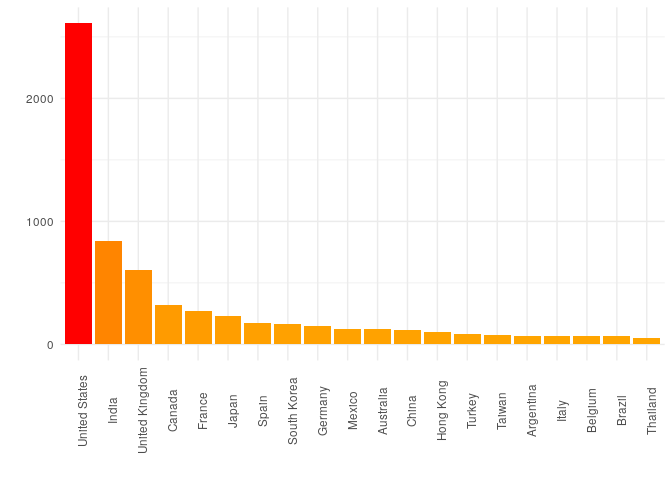
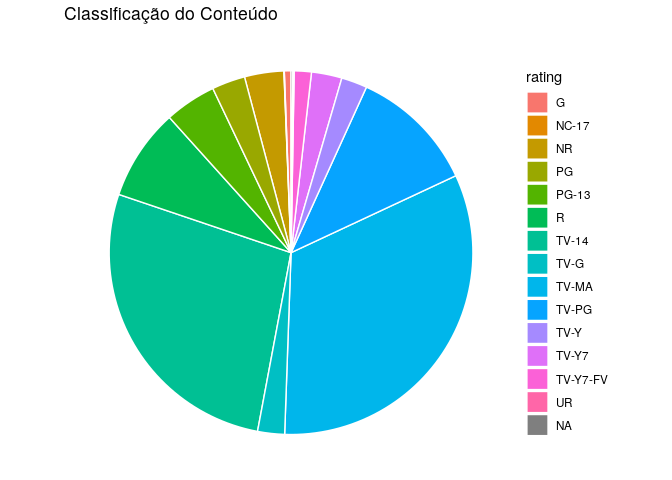
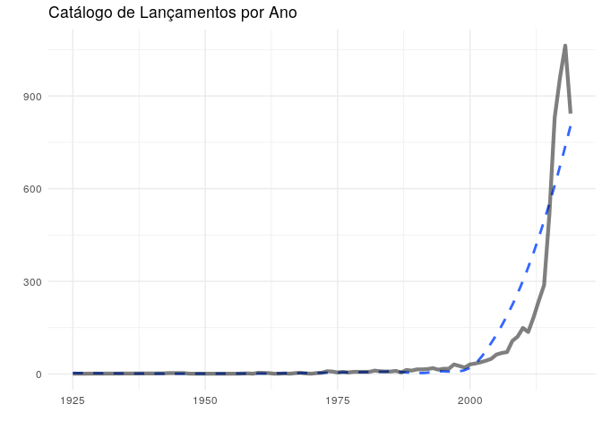
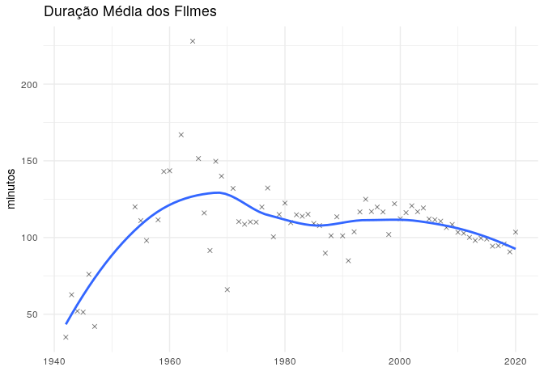

Trabalho Prático – IGTI Data Analytics
================

## Autor

Victor Wildner; <vcwildm@gmail.com>

## Apresentação

Para o projeto foi escolhido o data set [Netflix
Shows](https://www.kaggle.com/shivamb/netflix-shows) para avaliar o
catálogo de produção de conteúdo audiovisual da empresa. Nosso foco
será verificar quais tem sido os trends da plataforma e os players mais
influentes dela. Este artigo está escrito no formato de um livro de
código (codebook), mostrando o passo a passo da resolução do problema,
tendo por finalidade demonstrar como foram obtidos os resultados,
permitindo reproducibilidade de toda a análise realizada.

## Objetivos

Exercitar os conceitos vistos em aula com um projeto de análise de
dados. Esse projeto pretende explorar a metodologia envolvida na análise
exploratória de dados e diagnóstico, abrangendo desde a formulação do
problema até a apresentação do resultado.

## Questionamentos

A partir da análise prévia do data set foram levantadas as seguintes
questões:

**1 - Quais os países predominantes em produção de filmes e séries
presentes no catálogo de streaming?**

**2 - Em quais faixas etárias (selos) o conteúdo se encaixa?**

**3 - Como a indústria de produção audiovisual se comportou ao longo dos
anos?**

## Setup

Bibliotecas, seed e data set utilizado

``` r
library(tidyverse)
set.seed(42)
data <- read_csv("netflix_titles.csv")
```

# Análise Exploratória de Dados

Inicialmente vamos visualizar o conteúdo presente no data set

``` r
glimpse(data)
```

    ## Rows: 6,234
    ## Columns: 12
    ## $ show_id      <dbl> 81145628, 80117401, 70234439, 80058654, 80125979, 801638…
    ## $ type         <chr> "Movie", "Movie", "TV Show", "TV Show", "Movie", "TV Sho…
    ## $ title        <chr> "Norm of the North: King Sized Adventure", "Jandino: Wha…
    ## $ director     <chr> "Richard Finn, Tim Maltby", NA, NA, NA, "Fernando Lebrij…
    ## $ cast         <chr> "Alan Marriott, Andrew Toth, Brian Dobson, Cole Howard, …
    ## $ country      <chr> "United States, India, South Korea, China", "United King…
    ## $ date_added   <chr> "September 9, 2019", "September 9, 2016", "September 8, …
    ## $ release_year <dbl> 2019, 2016, 2013, 2016, 2017, 2016, 2014, 2017, 2017, 20…
    ## $ rating       <chr> "TV-PG", "TV-MA", "TV-Y7-FV", "TV-Y7", "TV-14", "TV-MA",…
    ## $ duration     <chr> "90 min", "94 min", "1 Season", "1 Season", "99 min", "1…
    ## $ listed_in    <chr> "Children & Family Movies, Comedies", "Stand-Up Comedy",…
    ## $ description  <chr> "Before planning an awesome wedding for his grandfather,…

Pela leitura prévia, verificamos que há muitas tags misturadas, como por
exemplo vários países inseridos na mesma produção de um filme, ou vários
atores envolvidos com o mesmo filme/série.

### Combinações de países registrados no Dataset

``` r
n_distinct(data$country)
```

    ## [1] 555

Aqui claramente observamos que há muitas combinações de países dentro de
uma mesma observação na coluna “country”.

### Quantidade de registros de filmes e séries

``` r
sum_type <- data %>% group_by(type) %>% 
    count(.)
sum_type
```

    ## # A tibble: 2 x 2
    ## # Groups:   type [2]
    ##   type        n
    ##   <chr>   <int>
    ## 1 Movie    4265
    ## 2 TV Show  1969

## 1 - Quais os países predominantes em produção de filmes e séries presentes no catálogo de streaming?

Para realizar esse estudo vamos precisar fatorar as observações que
estão conjuntas em “country” e colocá-las individualmente para assim
conseguir contabilizá-las. Isso se deve a diversos filmes e séries
possuírem co-autoria de pessoas em países distintos. Vamos fatorar a
matriz em 12 observações únicas.

``` r
tidy_countries <- data %>% 
    separate(
        country, 
        into = c("c1", "c2", "c3", "c4", "c5", "c6", "c7", "c8", "c9", "c10", "c11", "c12"), 
        sep = ",", 
        convert = TRUE
    )

longer_countries <- tidy_countries %>% 
    pivot_longer(
        c("c1", "c2", "c3", "c4", "c5", "c6", "c7", "c8", "c9", "c10", "c11", "c12"),
        names_to = "country_sect",
        values_to = "country_long"
    ) %>% 
    drop_na(country_long)
```

### Quantos registros foram cadastrados sem nenhum país?

``` r
print(
    paste(
        "O dataset possui", 
        nrow(filter(data, is.na(data$country))), 
        "filmes/séries sem país definido", 
        sep = " "
    )
)
```

    ## [1] "O dataset possui 476 filmes/séries sem país definido"

Vale ressaltar que foram removidos esses campos NA para prosseguir com a
análise, portanto há 476 observações a menos que no data set original.

``` r
count_country <- longer_countries %>% 
    select(country_long) %>%
    mutate(country_long = trimws(country_long)) %>% 
    group_by(country_long) %>% 
    count(country_long) %>%
    arrange(desc(n))

count_country_fit <- count_country %>% drop_na(country_long) %>% arrange(desc(n))
top_countries <- head(count_country_fit, n = 20)
top_countries
```

    ## # A tibble: 20 x 2
    ## # Groups:   country_long [20]
    ##    country_long       n
    ##    <chr>          <int>
    ##  1 United States   2610
    ##  2 India            838
    ##  3 United Kingdom   602
    ##  4 Canada           318
    ##  5 France           271
    ##  6 Japan            231
    ##  7 Spain            178
    ##  8 South Korea      162
    ##  9 Germany          151
    ## 10 Mexico           129
    ## 11 Australia        126
    ## 12 China            120
    ## 13 Hong Kong         97
    ## 14 Turkey            87
    ## 15 Taiwan            75
    ## 16 Argentina         68
    ## 17 Italy             67
    ## 18 Belgium           66
    ## 19 Brazil            66
    ## 20 Thailand          56

Vamos plotar essa análise em um gráfico, para ter maior dimensão da
posição entre os países que mais produziram filmes e séries.

``` r
ggplot(top_countries, aes(x = reorder(country_long, -n), y = n)) +
    geom_bar(aes(fill = n), stat = "identity") +
    scale_fill_gradient(low = "orange", high = "red") +
    theme_minimal() +
    labs(x = "", y = "") +
    theme(axis.text.x = element_text(angle = 90), legend.position = "none")
```

<!-- -->

### Síntese

Pelo gráfico podemos observar a distância enorme entre o primeiro e o
segundo colocado. Os Estados Unidos ficaram disparados em primeiro lugar
e possuem quase o triplo de conteúdo que o segundo colocado (Índia) na
plataforma, a Índia também possui relativamente mais conteúdo que o
Reino Unido, que também possui muito mais conteúdo que o Canadá.
Sucessivamente as diferenças começam a se tornar gradativamente menores.

## 2 - Em quais faixas etárias (selos) o conteúdo se encaixa?

Para responder a pergunta, realizaremos a soma dos “ratings” individuais

``` r
sum_rating <- data %>% group_by(rating) %>% 
    count(.) %>% 
    arrange(desc(n))

sapply(names(sum_rating)[-1], function(x) {
    sum_rating[paste0("percentage")] <<- sum_rating[x] / sum(sum_rating[x])
})
```

    ## $n.n
    ##  [1] 0.3251523901 0.2723772859 0.1124478665 0.0814886108 0.0458774463
    ##  [6] 0.0349695220 0.0295155598 0.0271094001 0.0239011870 0.0229387231
    ## [11] 0.0152390119 0.0059351941 0.0016041065 0.0011228746 0.0003208213

``` r
sum_rating
```

    ## # A tibble: 15 x 3
    ## # Groups:   rating [15]
    ##    rating       n percentage
    ##    <chr>    <int>      <dbl>
    ##  1 TV-MA     2027   0.325   
    ##  2 TV-14     1698   0.272   
    ##  3 TV-PG      701   0.112   
    ##  4 R          508   0.0815  
    ##  5 PG-13      286   0.0459  
    ##  6 NR         218   0.0350  
    ##  7 PG         184   0.0295  
    ##  8 TV-Y7      169   0.0271  
    ##  9 TV-G       149   0.0239  
    ## 10 TV-Y       143   0.0229  
    ## 11 TV-Y7-FV    95   0.0152  
    ## 12 G           37   0.00594 
    ## 13 <NA>        10   0.00160 
    ## 14 UR           7   0.00112 
    ## 15 NC-17        2   0.000321

``` r
ggplot(sum_rating, aes(x = "", y = n, fill = rating)) +
    geom_bar(stat = "identity", width = 0.5, color = "white") +
    theme_void() +
    coord_polar("y", start = 0) +
    labs(title = "Classificação do Conteúdo")
```

<!-- -->

### Síntese

Pela análise, verificamos que a maior parte do conteúdo presente na
plataforma possui os selos TV-MA com 32.52%, e TV-14 com 27.24% de
predominância nos
dados.

## 3 - Como a indústria de produção audiovisual se comportou ao longo dos anos?

### Quantidade de registros por ano de lançamento

``` r
year <- data %>% group_by(release_year) %>% count(.) %>% arrange(release_year)

## Removeremos 2020 pois ainda é ano em aberto

year_fit <- year %>% filter(release_year != "2020")

ggplot(year_fit, aes(x = release_year, y = n)) +
    geom_smooth(formula = y ~ x, method = "loess", se = FALSE, lty = "dashed") +
    geom_line(lwd = 1.5, alpha = 0.5) +
    theme_minimal() +
    labs(title = "Catálogo de Lançamentos por Ano", x = "", y = "")
```

<!-- -->

Conseguimos visualizar que, apesar de 2018 ser o primeiro ano de queda
na quantidade de filmes e séries publicados, há uma grande tendência de
crescimento dessa indústria, como pode ser observado pela linha de
tendência pontilhada.

### Duração média dos filmes ao longo dos anos

Inicialmente precisamos filtrar do data set apenas os registros contendo
filmes

``` r
movies <- data %>%
    filter(type == "Movie")

head(movies)
```

    ## # A tibble: 6 x 12
    ##   show_id type  title director cast  country date_added release_year rating
    ##     <dbl> <chr> <chr> <chr>    <chr> <chr>   <chr>             <dbl> <chr> 
    ## 1  8.11e7 Movie Norm… Richard… Alan… United… September…         2019 TV-PG 
    ## 2  8.01e7 Movie Jand… <NA>     Jand… United… September…         2016 TV-MA 
    ## 3  8.01e7 Movie #rea… Fernand… Nest… United… September…         2017 TV-14 
    ## 4  7.03e7 Movie Auto… Gabe Ib… Anto… Bulgar… September…         2014 R     
    ## 5  8.02e7 Movie Fabr… Rodrigo… Fabr… Chile   September…         2017 TV-MA 
    ## 6  7.03e7 Movie Good… Henrik … Jame… United… September…         2014 R     
    ## # … with 3 more variables: duration <chr>, listed_in <chr>, description <chr>

Agora precisamos limpar a coluna “duration” para representar apenas
números

``` r
movies$duration <- as.numeric(gsub(" min", "", movies$duration))
```

Vamos tirar a média de duração dos filmes por ano e plotar os
resultados.

``` r
mean_duration <- movies %>% 
    group_by(release_year) %>%
    summarise(mean = mean(duration)) 

ggplot(mean_duration, aes(release_year, mean)) +
    geom_point(alpha = 0.5, shape = 4) +
    geom_smooth(formula = y ~ x, method = "loess", se = FALSE) +
    labs(title = "Duração Média dos Filmes", x = "", y = "minutos") +
    theme_minimal()
```

<!-- -->

### Síntese

Observou-se que dos anos 1940 até 1970 há acréscimo considerável na
duração média dos filmes cadastrados na plataforma, mas que essa
tendência declinou desde então e continuou verdadeira até a década de
2020. Vale observar que não foram removidos os outliers da observação,
mas que o método de *loess* compensa a presença destes e que o ano de
2020 ainda não possui filmes suficientes cadastrados para considerar um
aumento no tempo médio de duração em relação aos anos que o antecedem.

### Referências

*Kaggle – Data Set Netflix Shows*
(<https://www.kaggle.com/shivamb/netflix-shows>)
